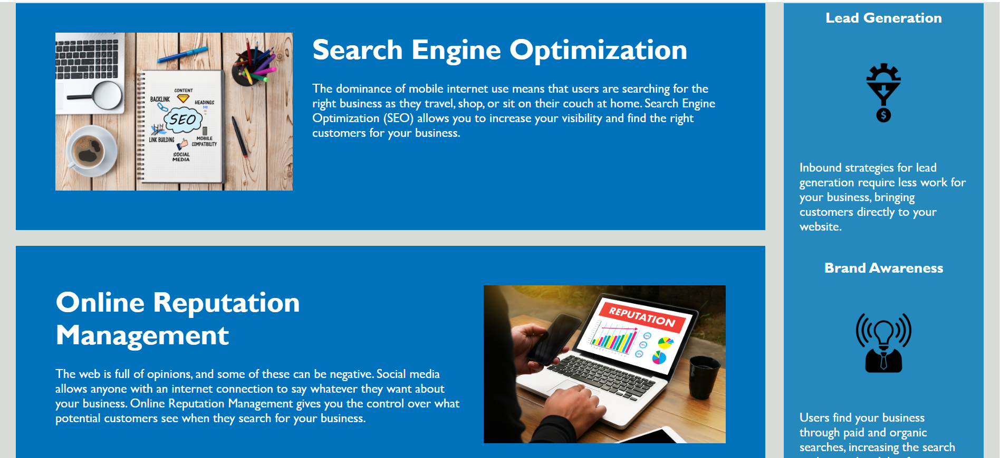
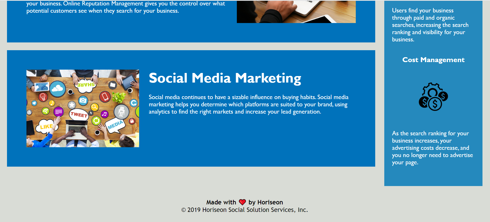

# Challenge-01 - HTML, CSS, and Git: Code Refactor

## Description
The purpose of this project is to perform code refactoring on the Horiseon webpage to address the following user story and acceptance criteria. Acceptance Criteria have been broken down into indidivual features (e.g. AC01). For details on each implementation, review the applicable 'AC' number in the "Features" section of this README.

### User Story

* AS A marketing agency,
I WANT a codebase that follows accessibility standards,
SO THAT our own site is optimized for search engines

### Acceptance Criteria

> * AC01: Accessibility Standards
>    - GIVEN a webpage meets accessibility standards
>    - (Apply items in “Things to always do…” in the Challenge README)

>* AC02: Semantic HTML Elements
>    -	WHEN I view the source code
>    -	THEN I find semantic HTML elements

>* AC03: Logical Structure
>    -	WHEN I view the structure of the HTML elements
>    -	THEN I find that the elements follow a logical structure independent of styling and positioning

>* AC04: Accessible alt Attributes
>    -	WHEN I view the icon and image elements
>    -	THEN I find accessible alt attributes

>* AC05: Sequential Heading Attributes
>    -	WHEN I view the heading attributes
>    -	THEN they fall in sequential order

>* AC06: Concise, Descriptive Title
>    -	WHEN I view the title element
>    -	THEN I find a concise, descriptive title

## Installation

> * To launch the webpage, open the browser and paste the following URL in the address bar: https://recenasu.github.io/Challenge-01/
> * To access the project repo, open the browser and paste the following URL in the address bar: https://github.com/recenasu/Challenge-01

## Usage

From the webpage navigation bar in the upper right, click on the desired topic, or scroll down.

The following images show the top, middle, and bottom of the webpage.

## Credits

N/A

## License

N/A

## Features

> * AC01: Accessibility Standards
>   -   Implementation:
>       -   Added an id to the Search Engine Optimization section element to fix the broken link in the nav bar

>* AC02: Semantic HTML Elements
>   -   Implementation:
>        -   Changed the "div" element to "figure" for the main image
>        -   Changed the "div class="header"" element to "header"
>        -   Renamed the ".header" style to to "header"
>        -   Renamed the ".header h1" style to "h1"
>        -   Changed the "span div class="seo"" element to "span"
>        -   Renamed the ".seo" style to "span"
>        -   Changed the "div" element in the header for the navigation bar to "nav"
>        -   Renamed ".header div" style to "nav"
>        -   Renamed the ".header div ul" style to "ul"
>        -   Renamed the ".header div ul li" style to "li"
>        -   Changed the "div class="content"" element to "section"
>        -   Changed the "div" elements within the "section" element to "article"
>        -   Changed the "div class="benefits"" element to "aside"
>        -   Renamed the ".benefits" style to "aside"
>        -   Changed the "div" elements within the "aside" element to "article"
>        -   Changed the "div class="footer"" element to "footer"
>        -   Renamed the ".footer" style to "footer"
>        -   See AC03 below for more styles that were consolidated and renamed to correspond with the changes in the HTML document.

>* AC03: Logical Structure
>   -   Implementation
>       -   Renamed the "header h1 seo" style to "seo" to make it easier to find in the stylesheet
>       -   Consolidated the classes "search-engine-optimization", "online-reputation-management", >and "social-media-marketing" to a single "topic" class for efficiency
>       -   Consolidated the "search-engine-optimization img", "online-reputation-management img", >and "social-media-marketing img" styles to a single "topic img" style
>       -   Consolidated the "search-engine-optimization h2", "online-reputation-management h2", and "social-media-marketing h2" styles to a single "topic h2" style
>       -   Placed the above ".topic..." styles directly under the "section" style in the .css file for logical grouping. 
>       -   Moved the ".float-left" and ".float-right" styles under the ".topic" style in the .css file for logical grouping since they only apply to the images under the topic class.
>       -   Consolidated the classes "benefit-lead", "benefit-brand", and "benefit-cost" to a single "aside-item" class for efficiency
>       -   Consolidated the "benefit-lead", "benefit-brand", and "benefit-cost" styles to a single "aside-item" style
>       -   Consolidated the "benefit-lead h3", "benefit-brand h3", and "benefit-cost h3" class styles to a single "aside-item h3" style
>       -   Consolidated the "benefit-lead img", "benefit-brand img", and "benefit-cost img" styles to a single "aside-item img" style

>* AC04: Accessible alt Attributes
>   -   Implementation
>       -   Added "title="People around a conference table"" to the "figure" element
>       -   Added "alt="Notebook, laptop, coffee cup, and other desktop items"" to the "img" element for the "search-engine-optimization" section article
>       -   Added "alt="Hands of person at desk using laptop and cell phone"" to the "img" element for the "online-reputation-management" section article
>       -   Added "alt="People around a table using social media on multiple types of devices"" to the "img" element for the "social-media-marketing" section article
>       -   Added "alt="Gear-Arrow-Money icon"" to the "img" element for the "lead-generation" aside article
>       -   Added "alt="Person with a radiating light bulb head wearing a tie - icon"" to the "img" element for the "brand-awareness" aside article
>       -   Added "alt="Gear with dollar sign icon"" to the "img" element for the "cost-management" aside article

>* AC05: Sequential Heading Attributes
>   -   Implementation:
>       -   Changed the "h2" element in the footer to "h4"
>       -   Removed the ".footer h2" style

>* AC06: Concise, Descriptive Title
>    -   Implementation:
>        -   Changed "title" element value from "Website" to "Horiseon Social Solution Services" 

    

## Tests

>1. Open the "CHALLENGE-01" repo using VSCode
>2. Inspect the "index.html" and "style.css" files to confirm all changes documented in the "Features" section of this README have been implemented
